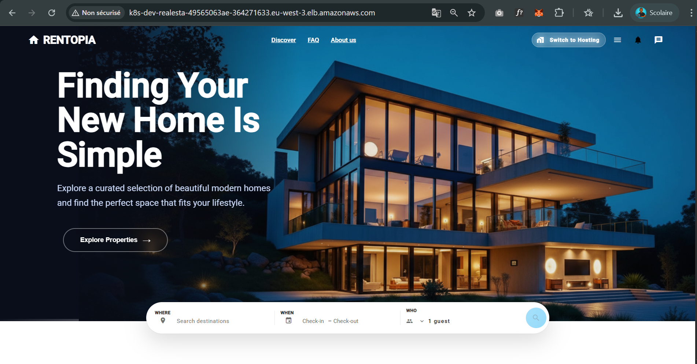
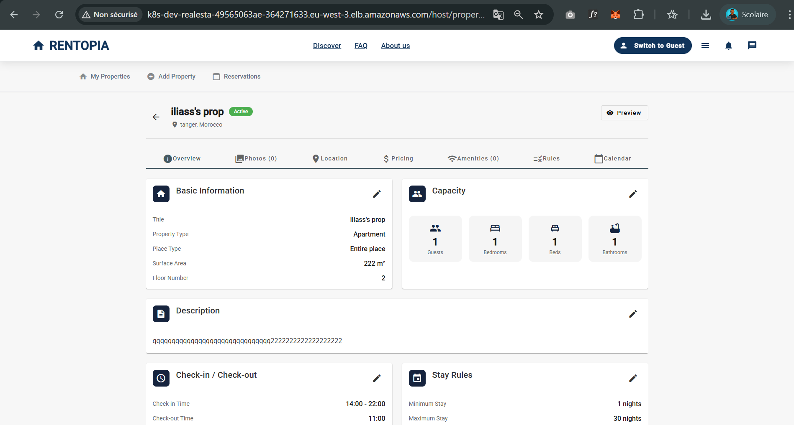

# 🏠 Plateforme de Location Décentralisée avec Blockchain

> Une plateforme de location de logements moderne intégrant la technologie blockchain Ethereum pour des transactions sécurisées et transparentes.

[](https://openjdk.java.net/)
[](https://spring.io/projects/spring-boot)
[](https://angular.io/)
[](https://ethereum.org/)
[](https://fastapi.tiangolo.com/)
[](https://www.uvicorn.org/)
[](https://www.python.org/)
[](https://scikit-learn.org/)
[](https://pandas.pydata.org/)
[](https://numpy.org/)
[](https://scipy.org/)
[](https://matplotlib.org/)
[](https://seaborn.pydata.org/)
[](https://plotly.com/)
[](https://jupyter.org/)
[](https://www.mysql.com/)

---

## 📋 Table des Matières

- [Vue d'ensemble](#-vue-densemble)
- [Architecture](#-architecture)
- [Technologies](#-technologies)
- [Équipe de Développement](#-équipe-de-développement)
    - [Backend Engineer](#-backend-engineer)
    - [Blockchain and AI Enginner](#-blockchain-and-ai-engineer)
    - [Frontend Developer](#-frontend-developer)
    - [Cloud Engineer](#-cloud-engineer)
    - [DevOps Engineer](#-devops-engineer)
- [Backend Architecture](#-backend-architecture)
- [Frontend Architecture](#-frontend-architecture)
- [Blockchain And AI Implementation](#-blockchainandai-implementation)
- [Cloud & DevOps](#-cloud--devops)

---
<!-- Landing page en haut (pleine largeur) -->
<p align="center">
  
</p>

<br/>

<!-- Deux images en bas, côte à côte -->
<p align="center">
  
  
</p>


## 🎯 Vue d'ensemble

Cette plateforme révolutionne le marché de la location immobilière en combinant :
- **Interface moderne** : React avec Material-UI
- **Architecture microservices** : Évolutivité et maintenabilité
- **Blockchain Ethereum** : Paiements sécurisés via smart contracts
- **Communication temps réel** : Chat intégré
- **Géolocalisation** : Cartographie interactive des propriétés


### Fonctionnalités Principales

✅ Inscription et authentification sécurisée (JWT)  
✅ Gestion complète des annonces immobilières  
✅ Système de réservation avec calcul automatique des prix  
✅ Paiements en cryptomonnaie (ETH) via MetaMask  
✅ Escrow décentralisé pour la protection des transactions  
✅ Chat temps réel propriétaire-locataire  
✅ Système d'avis et de notations  
✅ Notifications par email

---

## 🏗 Architecture

### Architecture en 5 Couches

```
┌─────────────────────────────────────────────────────────────┐
│                     FRONTEND LAYER                          │
│Angular + TypeScript+ NgRx + Angular Material + Ethers.js    │
└─────────────────────────────────────────────────────────────┘
                            ↓ HTTPS
┌─────────────────────────────────────────────────────────────┐
│                   API GATEWAY LAYER                         │
│     Spring Cloud Gateway (Port 8080)                        │
│   Routage | Sécurité JWT | Rate Limiting | Load Balancing   │
└─────────────────────────────────────────────────────────────┘
                            ↓
┌─────────────────────────────────────────────────────────────┐
│                  MICROSERVICES LAYER                        │
│  User (8081) | Listing (8082) | Booking (8083)              │
│  Payment (8084) | Messaging (8085) | Notification (8086)    │
│  Review (8087) | Media (8088) | Blockchain (8089)           │
└─────────────────────────────────────────────────────────────┘
                            ↓
┌─────────────────────────────────────────────────────────────┐
│               SERVICES INFRASTRUCTURE                       │
│  Eureka (8761) | Config Server (8888) | RabbitMQ (5672)     │
└─────────────────────────────────────────────────────────────┘
                            ↓
┌─────────────────────────────────────────────────────────────┐
│                     DATA LAYER                              │
│           MySQL 8.0 (3306) | AWS S3 Storage                 │
└─────────────────────────────────────────────────────────────┘
                            ↓
┌─────────────────────────────────────────────────────────────┐
│                  BLOCKCHAIN LAYER                           │
│     Ethereum Network (Sepolia) | Infura                     │
└─────────────────────────────────────────────────────────────┘
```

---


## 👥 Équipe de Développement

### 🎨 Backend Engineer
**Nom** : Bouzid Mina  
**Rôle** : Architecture & Développement Backend  
**Responsabilités** :
- Conception de l'architecture microservices
- Développement des 9 microservices backend
- Configuration Spring Cloud (Eureka, Gateway, Config)
- Base de données MySQL et intégrations
- Sécurité et authentification JWT
- Conception UML de l'application

---

### ⛓ Blockchain And AI  Engineer
**Nom** : Ikrame Houzane
**Rôle** : Blockchain & AI Engineer

**Responsabilités** :
- Conception et développement du contrat principal
- Déploiement sur le testnet Sepolia
- Développement de 4 modèles de Machine Learning
- Création d'un microservice REST performant (FastAPI)
- Préparation de l'intégration avec le backend

---

### ⚛️ Frontend Developer

**Nom** : Allali Fatima-ezzahra
**Rôle** : Développeur Frontend

**Responsabilités** :
- Développement de l'interface Angular avec TypeScript
- Intégration Ethers.js et MetaMask
- Développement des composants Angular Material
- Cartographie avec ngx-leaflet
- Gestion d'état avec NgRx (Store, Effects, Selectors)


---

### ☁️ Cloud Engineer
**Nom** : Azhich salma  
**Rôle** : Architecte Cloud & Infrastructure  
**Responsabilités** :
- Architecture cloud et déploiement AWS
- Configuration des services cloud (S3, RDS, etc.)
- Optimisation des performances et coûts
- Sécurité cloud et conformité
- Plan de reprise d'activité

---

### 🚀 DevOps Engineer
**Nom** : KADDAR MOHAMED ILIASS
**Rôle** : DevOps & Infrastructure  
**Responsabilités** :
- Containerisation avec Docker
- Orchestration avec Kubernetes
- CI/CD pipelines
- Monitoring et logging
- Automatisation de l'infrastructure

---

##  Conception UML:
### Diagramme de classes


### 📁Package des Users

**Diagramme des classes**


**Diagramme des activités**


**Diagramme des cas d’utilisation**


### 📁Package des Réservations

**Diagramme des activités**


**Diagramme des cas d’utilisation**


### 📁Package de Communication

**Diagramme des cas d’utilisation**


**Diagramme des activités**


### 📁Package des annonces

**Diagramme des activités**


**Diagramme des cas d’utilisation**


--- 

## 🔧 Backend Architecture

### ✅ **Conception de l'architecture microservices 5 couches**
Conception et implémentation d'une architecture modulaire et évolutive basée sur les principes des microservices, permettant une scalabilité horizontale et une maintenabilité optimale.

### ✅ **Mise en place complète de l'infrastructure Spring Cloud**

#### **Eureka Server (Port 8761)** - Service Discovery avec health checking
- Configuration du serveur de découverte de services
- Implémentation du health checking automatisé
- Gestion des instances de services et de leur disponibilité
- Load balancing côté client intégré

#### **Config Server (Port 8888)** - Configuration centralisée avec backend Git
- Création d'un repository Git pour la gestion des configurations
- Support multi-environnement (dev, staging, prod)
- Refresh dynamique des configurations sans redémarrage
- Chiffrement des propriétés sensibles

#### **API Gateway (Port 8080)** - Routage intelligent, sécurité JWT, rate limiting, CORS
- Configuration des routes dynamiques pour les microservices
- Implémentation de la sécurité JWT avec validation des tokens
- Rate limiting pour la protection contre les attaques DDoS
- Configuration CORS pour la sécurité des requêtes cross-origin
- Filtres personnalisés pour le logging et le monitoring

### ✅ **Configuration RabbitMQ pour la communication asynchrone**
- Configuration des exchanges, queues et bindings
- Implémentation de patterns publish/subscribe
- Gestion des dead letter queues pour les messages en échec
- Configuration de la persistance des messages
- Optimisation des performances pour le message broker

### ✅ **Conception complète de la base de données MySQL**
- Conception du schéma de données normalisé
- Définition des relations (One-to-Many, Many-to-Many, One-to-One)
- Optimisation des indexes pour les performances
- Configuration des contraintes d'intégrité référentielle
- Design des vues et stored procedures

### ✅ **Documentation technique exhaustive**
- Documentation de l'architecture globale
- Guides d'installation et de configuration
- Documentation API
- Diagrammes d'activité
- Diagrammes de classe

---

## 🔧 Développement des 9 Microservices

### 1. **User Service (Port 8081)** ✅
#### **Authentification complète (JWT avec refresh tokens)**
- Implémentation du flow d'authentification JWT
- Gestion des tokens d'actualisation (refresh tokens)
- Blacklisting des tokens révoqués
- Expiration et rotation des tokens

#### **Système de vérification email (SMTP) **
- Intégration avec service SMTP
- Génération de tokens de vérification uniques
- Logique de ré-émission de codes de vérification

#### **Gestion des profils et wallets Ethereum**
- Création et mise à jour des profils utilisateurs
- Association des adresses Ethereum aux utilisateurs
- Vérification de la propriété des wallets
- Historique des transactions utilisateur

#### **Blacklist JWT et audit logs**
- Système de blacklist pour les tokens révoqués
- Audit logs pour toutes les actions sensibles
- Conformité RGPD pour les données personnelles
- Rotation automatique des logs d'audit

#### **Support multi-langues (20 langues)**
- Table des langues supportées
- Association utilisateur-langue

#### **Spring Security avec BCrypt**
- Configuration de la sécurité Spring Boot 3
- Hashing des mots de passe avec BCrypt
- Rôles et permissions (USER, HOST, ADMIN)
- Protection contre les attaques par force brute

---

### 2. **Listing Service (Port 8082)** ✅
#### **CRUD complet des propriétés immobilières**
- Opérations Create, Read, Update, Delete
- Validation des données d'entrée
- Gestion des relations propriété-utilisateur
- Versioning des modifications

#### **Système de disponibilités et calendrier**
- Interface de calendrier interactive
- Blocage/déblocage des dates
- Validation des chevauchements de réservations
- Synchronisation avec le booking service

#### **Tarification dynamique (weekend, semaine, mois)**
- Calcul des prix selon la saisonnalité
- Discounts pour séjours prolongés
- Frais de service et de nettoyage
- Historique des changements de prix

#### **Gestion des équipements (amenities)**
- Catalogue d'équipements prédéfinis
- Association propriété-équipements
- Recherche par équipements disponibles
- Images et descriptions des équipements

#### **Versioning des propriétés avec snapshots**
- Snapshots des modifications importantes
- Restauration de versions précédentes
- Historique complet des changements
- Audit des modifications

#### **Recherche et filtrage avancés**
- Recherche textuelle sur titre et description
- Filtrage par localisation, prix, équipements
- Tri par pertinence, prix, note
- Pagination et lazy loading

---

### 3. **Booking Service (Port 8083)** ✅

#### **Validation des disponibilités en temps réel**
- Vérification de disponibilité atomique
- Locking des dates pendant la réservation
- Rollback en cas d'échec de transaction
- Cache de disponibilité pour performances

#### **Calcul automatique des prix (nuits, frais, taxes)**
- Calcul basé sur les dates et le prix par nuit
- Application des frais de service et de nettoyage
- Taxes locales et TVA
- Récapitulatif détaillé des coûts

#### **Machine à états pour les statuts**
- Gestion des transitions d'état (PENDING, CONFIRMED, CANCELLED, etc.)
- Validation des transitions autorisées
- Historique des changements d'état
- Actions automatiques selon l'état

#### **Historique complet des changements**
- Tracking de toutes les modifications de réservation
- Audit trail pour conformité
- Restauration en cas d'erreur
- Reporting des modifications

#### **Intégration blockchain pour les confirmations**
- Synchronisation avec les smart contracts
- Vérification des paiements on-chain
- Confirmation automatique après paiement
- Gestion des échecs de transaction blockchain

#### **Gestion des annulations**
- Politiques d'annulation configurables
- Calcul automatique des remboursements
- Notifications aux parties concernées
- Historique des annulations

---

### 4. **Payment Service (Port 8084)** ✅
#### **Intégration Web3j avec Ethereum**
- Configuration du client Web3j
- Connexion aux nodes Ethereum (Infura/Alchemy)
- Gestion des connexions HTTP/WebSocket
- Fallback sur différents providers

#### **Gestion des transactions blockchain**
- Construction des transactions Ethereum
- Estimation des gas fees
- Envoi et suivi des transactions
- Confirmation des blocs

#### **Escrow de fonds décentralisé**
- Dépôt des fonds dans le smart contract
- Vérification des soldes en escrow
- Libération des fonds selon conditions
- Gestion des litiges

#### **Vérification des soldes ETH**
- Vérification des soldes utilisateur
- Validation des fonds suffisants
- Notifications de solde insuffisant
- Suggestions de recharge

#### **Suivi des gas fees**
- Monitoring des prix du gas
- Optimisation des frais de transaction
- Historique des gas fees payés
- Alertes de gas fees anormalement élevés

#### **Gestion des remboursements**
- Initiation des remboursements on-chain
- Suivi du statut des remboursements
- Notifications de remboursement complété
- Reporting des remboursements

#### **Confirmation de transactions on-chain**
- Écoute des événements blockchain
- Vérification des confirmations
- Synchronisation avec la base de données
- Gestion des forks et réorganisations

---

### 5. **Messaging Service (Port 8085)** ✅
#### **Chat temps réel avec WebSocket**
- Configuration du serveur WebSocket
- Gestion des sessions utilisateur
- Reconnexion automatique

#### **Gestion des conversations multi-participants**
- Création de conversations (1-1)
- Visibilité des conversations

#### **Statut de lecture et notifications**
- Tracking des messages lus/non lus
- Notifications push pour nouveaux messages

#### **Archivage automatique des conversations**
- Politiques d'archivage configurables
- Compression des messages archivés
- Restauration des conversations archivées
- Purge automatique des anciennes données

---

### 6. **Notification Service (Port 8086)** ✅
#### **Envoi d'emails via SMTP (JavaMail)**
- Configuration des serveurs SMTP
- Templates HTML pour les emails
- Gestion des pièces jointes
- Tracking des ouvertures et clics

#### **File d'attente RabbitMQ pour async**
- Découplage de l'envoi des notifications
- Retry automatique en cas d'échec
- Priorisation des notifications urgentes
- Monitoring de la file d'attente

---

### 7. **Review Service (Port 8087)** ✅
#### **Système complet d'avis et notations**
- Publication d'avis après séjour
- Modération des avis avant publication
- Réponses des propriétaires aux avis
- Signalement d'avis inappropriés

#### **Calcul des moyennes de notes**
- Moyenne globale par propriété
- Tendances des notes dans le temps
- Comparaison avec la moyenne locale

#### **Gestion de la visibilité des avis**
- Contrôle de la visibilité par les utilisateurs
- Highlight des avis les plus utiles

---

### 8. **Media Service (Port 8088)** ✅
#### **Upload de photos avec Multipart**
- Upload de fichiers multipart
- Validation des types de fichiers
- Limites de taille configurables
- Progress bar pour l'upload

#### **Compression et redimensionnement d'images**
- Compression JPEG/PNG optimisée
- Redimensionnement automatique
- Génération de thumbnails
- Conservation des métadonnées EXIF

#### **Intégration AWS S3 pour le stockage**
- Configuration des buckets S3
- Gestion des permissions IAM
- Transfert optimisé des fichiers
- Politiques de rétention et d'archivage

#### **Génération de thumbnails**
- Thumbnails de différentes tailles
- Cache des thumbnails générés
- Format WebP pour performances
- Lazy loading optimisé

#### **Hash de photos pour déduplication**
- Calcul de hash MD5/SHA des images
- Détection des doublons
- Réutilisation des images existantes
- Optimisation du stockage

#### **Gestion de l'ordre d'affichage**
- Drag & drop pour réorganiser les photos
- Photo principale sélectionnable
- Rotation automatique selon orientation
- Masquage de photos de mauvaise qualité

---

### 9. **Blockchain Service (Port 8089)** ✅
#### **Interface complète avec smart contracts**
- Génération des wrappers Java à partir des ABI
- Appel des fonctions du smart contract
- Lecture des variables d'état
- Gestion des erreurs et exceptions

#### **Décodage des events blockchain**
- Écoute des événements en temps réel
- Décodage des données d'événement
- Mapping vers objets Java
- Persistance dans la base de données

#### **Création de réservations on-chain**
- Appel de la fonction createBooking
- Validation des paramètres
- Gestion des erreurs de transaction
- Confirmation de la création

#### **Check-in / Check-out automatisés**
- Trigger automatique aux dates prévues
- Vérification des conditions préalables
- Exécution des transactions on-chain
- Synchronisation avec le booking service

#### **Libération des fonds escrow**
- Vérification des conditions de libération
- Appel de la fonction releaseFunds
- Distribution des fonds aux parties
- Gestion des litiges en cours

#### **Synchronisation backend ↔ blockchain**
- Reconciliation régulière des données
- Détection et correction des divergences
- Audit de la cohérence des données
- Reporting de la santé de la synchronisation

---

## 🛠️ Technologies Maîtrisées - Backend

### **Frameworks & Librairies**
- **Spring Boot 3.x** - Framework principal
- **Spring Cloud** - Gateway, Config, Eureka, Circuit Breaker
- **Spring Security** - Authentification et autorisation
- **Spring Data JPA** - Persistance des données
- **Spring WebSocket** - Communication temps réel

### **Base de Données & Cache**
- **MySQL 8.0** - Base de données relationnelle principale
- **Hibernate** - ORM avec cache de second niveau
- **Redis** - Cache distribué et session storage

### **Message Brokers & Communication**
- **RabbitMQ** - Message broker pour communication asynchrone
- **STOMP Protocol** - Protocole pour WebSocket

### **Blockchain Integration**
- **Web3j** - Client Java pour Ethereum
- **Solidity ABI** - Interface avec smart contracts
- **Infura/Alchemy** - Nodes Ethereum managés

### **External Services Integration**
- **JavaMail** - Envoi d'emails SMTP
- **Twilio SDK** - Envoi de SMS
- **AWS S3 SDK** - Stockage de fichiers cloud

### **Sécurité**
- **JWT (JSON Web Tokens)** - Authentification stateless
- **BCrypt** - Hashing des mots de passe
- **Spring Security OAuth2** - Authentification tierce (optionnel)
- **Rate Limiting** - Protection contre les abus

### **Monitoring & Observability**
- **Spring Boot Actuator** - Métriques d'application
- **Micrometer** - Métriques pour Prometheus
- **Logback/SLF4J** - Logging structuré

---

## 📊 Statistiques de Contribution Backend

### **Volumes de Code**
- **Lignes de code total** : ~40,000+ (backend uniquement)
- **Classes Java** : 150+
- **Interfaces** : 80+
- **Tests unitaires** : 200+
- **Tests d'intégration** : 50+

### **Performances**
- **Temps de réponse moyen** : < 200ms (API Gateway)
- **Disponibilité cible** : 99.9%
- **Scalabilité** : Horizontal scaling supporté
- **Throughput** : 1000+ req/sec par instance

### **Sécurité**
- **JWT token lifetime** : 15 minutes (access), 7 jours (refresh)
- **BCrypt rounds** : 10 (équilibre sécurité/performance)
- **Rate limiting** : 100 req/min par utilisateur
- **Input validation** : Validation sur tous les endpoints

---

## 🏆 Architecture Patterns Implementés

### **Design Patterns**
- **Repository Pattern** - Abstraction de l'accès aux données
- **Service Pattern** - Logique métier encapsulée
- **DTO Pattern** - Transfert de données optimisé
- **Factory Pattern** - Création d'objets complexes
- **Strategy Pattern** - Algorithmes interchangeables
- **Observer Pattern** - Événements et notifications

### **Microservices Patterns**
- **API Gateway Pattern** - Point d'entrée unique
- **Circuit Breaker Pattern** - Tolérance aux pannes
- **Service Discovery Pattern** - Découverte dynamique
- **Config Server Pattern** - Configuration centralisée

### **Event-Driven Patterns**
- **Event Sourcing** - Persistance basée sur événements
- **Publish-Subscribe** - Communication découplée
- **Event Carried State Transfer** - Synchronisation par événements
---

---


# 🎨 Frontend Architecture


---

## 📋 Table des matières

- [🎯 Fonctionnalités](#-fonctionnalités)
- [🛠️ Stack Technique](#️-stack-technique)
- [🏗️ Architecture](#️-architecture)
- [📁 Structure du Projet](#-structure-du-projet)
- [📸 Aperçu](#-aperçu)

---

## 🎯 Fonctionnalités

### 🔐 Authentification Web3
- ✅ Connexion/Inscription avec **MetaMask**
- ✅ Signature de message pour authentification
- ✅ Gestion des wallets Ethereum
- ✅ Vérification d'email

### 🏡 Gestion des Propriétés
- ✅ Recherche avancée avec filtres (lieu, prix, équipements, type)
- ✅ Autocomplete intelligent de localisation
- ✅ Vue détaillée avec galerie photos
- ✅ Carte interactive (Leaflet)
- ✅ Système d'avis et notes
- ✅ Suggestion de prix par IA

### 🏠 Espace Propriétaire (Host)
- ✅ Tableau de bord avec statistiques
- ✅ Création de propriété (wizard multi-étapes)
- ✅ Gestion du calendrier de disponibilité
- ✅ Édition modulaire des informations
- ✅ Gestion des réservations reçues
- ✅ Upload de photos (S3)

### 📅 Réservations
- ✅ Réservation instantanée ou sur demande
- ✅ Calcul automatique des prix (nuits, frais, réductions)
- ✅ Paiement en **ETH** via MetaMask
- ✅ Système d'escrow blockchain
- ✅ Check-in / Check-out
- ✅ Historique des réservations (à venir, passées, annulées)
- ✅ Annulation avec remboursement

### 💬 Messagerie Temps Réel
- ✅ Chat WebSocket entre hôte et locataire
- ✅ Indicateurs de présence (en ligne/hors ligne)
- ✅ Compteur de messages non lus
- ✅ Statut de lecture des messages
- ✅ Conversations liées aux réservations

### 🔔 Notifications
- ✅ Notifications en temps réel
- ✅ Badge avec compteur de non-lus
- ✅ Marquer comme lu
- ✅ Historique complet

### ⭐ Système d'Avis
- ✅ Notation par critères (propreté, emplacement, communication...)
- ✅ Commentaires détaillés
- ✅ Statistiques globales par propriété
- ✅ Modification/Suppression d'avis

### 👤 Profil Utilisateur
- ✅ Informations personnelles
- ✅ Gestion des langues parlées
- ✅ Photo de profil
- ✅ Historique des avis
- ✅ Mode hôte / invité

---

## 🛠️ Stack Technique

### Frontend Core
- **Framework** : Angular 18.2
- **Language** : TypeScript 5.5
- **State Management** : NgRx 18.0 (Store, Effects, Selectors)
- **UI Library** : Angular Material 18.2
- **Styling** : SCSS

### Blockchain & Web3
- **Library** : Ethers.js 6.13
- **Network** : Sepolia Testnet
- **Wallet** : MetaMask

### Cartographie
- **Maps** : ngx-leaflet 18.0 + Leaflet 1.9
- **Geocoding** : Google Maps API

### Communication
- **HTTP Client** : Axios 1.13
- **Real-time** : Socket.io-client 4.8
- **WebSocket** : Native WebSocket API

### Backend Integration
- **API Gateway** : Spring Cloud Gateway (port 8080)

---

## 🏗️ Architecture

```
Frontend (Angular 18)
├── Core Layer
│   ├── Services (API, Auth, Web3, WebSocket...)
│   ├── Guards (auth, noAuth)
│   ├── Models (TypeScript interfaces)
│   └── Pipes (EthPrice)
│
├── State Management (NgRx)
│   ├── Auth Store
│   ├── Booking Store
│   ├── Listings Store
│   ├── Messaging Store
│   ├── Notifications Store
│   └── Payment Store
│
├── Features (Smart Components)
│   ├── Home
│   ├── Auth (Login, Register)
│   ├── Listings (Search, Filters)
│   ├── Property Detail
│   ├── Booking Management
│   ├── Host Dashboard
│   ├── Messages
│   └── Profile
│
└── Shared (Presentational Components)
    ├── Navbar
    ├── Footer
    ├── Search Bar
    ├── Property Card
    ├── Notification Bell
    └── Reviews
```

### Communication avec le Backend

```
Angular App
    ↓
API Gateway (http://localhost:8080/api)
    ↓
Microservices (8081-8089)
    ↓
Bases de données (PostgreSQL, MongoDB)
    ↓
Blockchain (Sepolia Testnet)
```

---

## 📁 Structure du Projet

```
src/
├── app/
│   ├── core/                          # Services, Guards, Models
│   │   ├── guards/                    # auth.guard, noAuth.guard
│   │   ├── models/                    # 19 modèles TypeScript
│   │   ├── pipes/                     # eth-price.pipe
│   │   └── services/                  # 15+ services
│   │       ├── api.service.ts
│   │       ├── auth.service.ts
│   │       ├── booking.service.ts
│   │       ├── property.service.ts
│   │       ├── payment.service.ts
│   │       ├── web3.service.ts
│   │       ├── websocket.service.ts
│   │       └── ...
│   │
│   ├── features/                      # Composants métier
│   │   ├── home/
│   │   ├── auth/
│   │   │   ├── login/
│   │   │   └── register/
│   │   ├── listing/
│   │   │   ├── listings.component.ts
│   │   │   ├── filters-modal/
│   │   │   └── property-card/
│   │   ├── property-detail/
│   │   │   ├── property-detail.component.ts
│   │   │   ├── booking-card/
│   │   │   └── payment-modal/
│   │   ├── my-bookings/
│   │   │   ├── my-bookings.component.ts
│   │   │   ├── booking-card/
│   │   │   ├── booking-detail-dialog/
│   │   │   └── review-form/
│   │   ├── host/
│   │   │   ├── host-layout/
│   │   │   ├── host-properties/
│   │   │   ├── property-wizard/
│   │   │   ├── host-property-detail/
│   │   │   └── host-bookings/
│   │   ├── messages/
│   │   │   ├── chat-view/
│   │   │   ├── conversations-list/
│   │   │   └── message-badge/
│   │   └── profile/
│   │       ├── profile.component.ts
│   │       ├── profile-info/
│   │       ├── profile-languages/
│   │       └── profile-reviews/
│   │
│   ├── shared/                        # Composants réutilisables
│   │   └── components/
│   │       ├── navbar/
│   │       ├── footer/
│   │       ├── search-bar/
│   │       ├── notification-bell/
│   │       ├── about/
│   │       ├── contact/
│   │       ├── faq/
│   │       ├── trust-safety/
│   │       ├── how-it-works/
│   │       └── become-host/
│   │
│   ├── store/                         # NgRx State Management
│   │   ├── auth/
│   │   │   ├── auth.actions.ts
│   │   │   ├── auth.effects.ts
│   │   │   ├── auth.reducer.ts
│   │   │   └── auth.selectors.ts
│   │   ├── booking/
│   │   ├── listings/
│   │   ├── messaging/
│   │   ├── notifications/
│   │   └── payment/
│   │
│   ├── app.routes.ts                  # Configuration du routing
│   ├── app.component.ts
│   └── app.config.ts
│
├── environments/
│   ├── environment.ts                 # Config développement
│   └── environment.prod.ts            # Config production
│
├── styles.scss                        # Styles globaux
└── index.html
```

---


## 📸 Aperçu

### Page d'Accueil
- Hero section avec search bar
- Destinations populaires
- Propriétés mises en avant
- Section "Pourquoi nous choisir"
- Footer informatif

### Recherche et Filtres
- Barre de recherche intelligente
- Filtres avancés (prix, type, équipements, règles)
- Cartes de propriétés avec photos
- Pagination et tri

### Détail de Propriété
- Galerie photos
- Informations complètes
- Carte de localisation
- Calendrier de disponibilité
- Section réservation
- Avis clients

### Paiement
- Modal de paiement step-by-step
- Vérification du solde ETH
- Intégration MetaMask
- Confirmation blockchain
- Tracking de transaction

### Espace Hôte
- Dashboard avec statistiques
- Gestion des propriétés
- Calendrier de réservations
- Messagerie avec clients
- Édition complète des annonces

### Messagerie
- Liste des conversations
- Chat en temps réel
- Indicateurs de présence
- Notifications de nouveaux messages


 
---

## Blockchain And AI Implementation
**Technologies principales** : Solidity, Hardhat, Ethers.js, Python, FastAPI, Machine Learning  
**Réseau** : Ethereum Sepolia Testnet
## Mon périmètre de responsabilité

1. **Blockchain (Smart Contracts)**
    - Conception et développement du contrat principal
    - Déploiement sur le testnet Sepolia
    - Tests

2. **Intelligence Artificielle**
    - Développement de 4 modèles de Machine Learning
    - Création d'un microservice REST performant (FastAPI)
    - Préparation de l'intégration avec le backend

## 🔗 Partie 1 – Blockchain
## 📋 Vue d'ensemble

Le module `rental-dapp-blockchain` contient l'implémentation d'un **smart contract Ethereum** pour gérer les réservations de propriétés immobilières de manière **décentralisée et transparente**.

### 🎯 Objectifs principaux

- Créer et gérer des réservations avec paiements en escrow (séquestre)
- Implémenter une politique de remboursement flexible
- Gérer les frais de plateforme (5% prélevés à la réservation)
- Permettre aux locataires de noter les propriétés (ratings immuables)
- Protéger les propriétaires et locataires via des smart contracts
- Intégrer la blockchain avec le backend
### Technologies utilisées

| Technologie     | Version     | Utilisation                         
|-----------------|-------------|-------------------------------------
| Solidity        | 0.8.20      | Langage smart contract              |
| Hardhat         | 2.26.3      | Framework de développement & tests  |
| Ethers.js       | 6.15.0      | Interaction avec la blockchain      |
| OpenZeppelin    | Latest      | Bibliothèques sécurisées            |
| Node.js         | 22.14.0     | Runtime JavaScript
---

## 🏗️ Architecture

### Structure du projet

```
rental-dapp-blockchain/
├── contracts/
│   └── RentalPlatform.sol          # Smart contract principal
├── scripts/
│   ├── deployment/
│   │   ├── deploy.js               # Script de déploiement
│   │   └── deployment-info.json    # Infos du contrat déployé
│   └── interactions/
│       ├── testRental.js           # Tests d'intégration
│       ├── superTestRental.js      # Tests avancés
│       └── stressTestRental.js     # Tests de charge
├── test/
│   └── unit/
│       └── RentalPlatform.test.js  # Tests unitaires
├── blockchain-integration/         # SDK pour intégration
│   ├── services/
│   │   ├── contractService.js      # Interactions avec contrat
│   │   ├── eventListener.js        # Écoute des événements
│   │   └── syncService.js          # Synchronisation BDD
│   ├── config/
│   │   └── blockchain.config.js    # Configuration
│   └── abi/
│       └── RentalPlatform.json     # ABI du contrat
├── hardhat.config.js               # Configuration Hardhat
├── package.json                    # Dépendances
└── README.md                       # Documentation technique
```
---

## 🔗 Smart Contract - RentalPlatform.sol

### Caractéristiques principales

#### 1. **Gestion des réservations** 📅

Le contrat implémente un système complet de réservation avec états:

```javascript
enum BookingStatus {
    PENDING,      // En attente
    CONFIRMED,    // Confirmée et payée (argent en escrow)
    CHECKED_IN,   // Locataire arrivé (séjour en cours)
    CHECKED_OUT,  // Locataire parti (en attente de libération)
    COMPLETED,    // Terminée (paiements libérés)
    CANCELLED     // Annulée
}
```

**Cycle de vie d'une réservation:**
1. **Création** → Locataire crée réservation + paie en ETH
2. **Confirmation** → Argent en escrow dans le contrat
3. **Check-in** → Locataire arrive
4. **Check-out** → Locataire part
5. **Libération** → Admin libère les fonds au propriétaire
6. **Completion** → Réservation terminée
7. **Optional: Rating** → Locataire note la propriété

#### 2. **Paiements en escrow** 💰

```javascript
// Frais de plateforme: 5%
platformFee = rentalAmount * 5 / 100
totalAmount = rentalAmount + platformFee

// Les frais vont IMMÉDIATEMENT au wallet plateforme
// Le rentalAmount reste BLOQUÉ jusqu'au check-out complet
```

**Sécurité:**
- Les fonds ne peuvent être libérés qu'après le check-out
- Les frais ne sont PAS remboursables en cas d'annulation
- Utilise le pattern "Pull" pour les retraits (plus sûr)

#### 3. **Politique de remboursement** 📋

En cas d'annulation AVANT check-in:

| Délai avant check-in | Remboursement |
|---|---|
| > 7 jours | 100% remboursement |
| 3-7 jours | 50% remboursement |
| < 3 jours | 0% remboursement |

**Important:** Les frais de plateforme (5%) ne sont JAMAIS remboursables.

#### 4. **Prévention du double-booking** 🔒

```javascript
function isPropertyAvailable(
    uint256 _propertyId,
    uint256 _startDate,
    uint256 _endDate
) public view returns (bool)
```

Vérification automatique pour éviter que 2 réservations se chevauchent:
- Parcourt toutes les réservations du logement
- Ignore les réservations annulées ou complétées
- Détecte les chevauchements de dates
- Rejette si conflit détecté

#### 5. **Système de notation** ⭐

```javascript
// Une note par réservation (après COMPLETED)
// Notes stockées sur blockchain = immuables
// Notes: 1 à 5 étoiles

struct Rating {
    address tenant;      // Qui a noté
    uint256 propertyId;  // Propriété notée
    uint8 stars;         // Note 1-5
    uint256 timestamp;   // Quand
}

// Optimisation: O(1) pour obtenir la moyenne
function getAverageRating(uint256 _propertyId)
    returns uint256 (moyenne * 100)
```

**Avantage:** Les notes sont immuables sur la blockchain → impossible de tricher.

#### 6. **Sécurité multi-couches** 🛡️

**Protections implémentées:**

| Protection | Détail |
|---|---|
| **ReentrancyGuard** | Évite les attaques de réentrance sur les retraits |
| **Ownable** | Contrôle d'accès admin (onlyOwner) |
| **Modifiers** | Vérification des conditions avant exécution |
| **Checks-Effects-Interactions** | Modifie l'état AVANT les transferts (sécurité) |
| **Pull Pattern** | Propriétaires retirent eux-mêmes (pas de push direct) |
| **Input Validation** | Validation stricte de tous les paramètres |

---

## 📡 Fonctions principales du contrat

### Fonctions client (Locataires)

#### `createBooking(propertyId, startDate, endDate, rentalAmount)` payable
Crée une réservation avec paiement:
- Vérifie disponibilité logement
- Calcule frais (5%)
- Transfère ETH
- Retourne bookingId

#### `checkIn(bookingId)`
Marque l'arrivée du locataire:
- Seulement le locataire
- Après startDate
- Change statut: CONFIRMED → CHECKED_IN

#### `checkOut(bookingId)`
Marque le départ du locataire:
- Seulement le locataire
- Change statut: CHECKED_IN → CHECKED_OUT

#### `cancelBooking(bookingId)`
Annule une réservation (avant check-in):
- Seulement avant startDate
- Applique politique de remboursement
- Frais plateforme non remboursables

#### `addRating(bookingId, stars)`
Ajoute une note après séjour:
- Seulement après COMPLETED
- Stars: 1-5
- Stocké immuablement sur blockchain

### Fonctions propriétaire

#### `withdraw()`
Retire ses fonds en attente:
- Pattern Pull (plus sûr)
- Propriétaire reçoit rentalAmount après check-out complet
- Protection contre réentrance

### Fonctions admin (onlyOwner)

#### `setPropertyOwner(propertyId, ownerAddress)`
Enregistre le propriétaire d'un logement:
- **OBLIGATOIRE** avant réservation
- Permet la libération des fonds après check-out

#### `releaseFunds(bookingId)`
Libère les fonds au propriétaire après check-out:
- Seulement admin
- Crédite pendingWithdrawals du propriétaire
- Statut: CHECKED_OUT → COMPLETED

#### `setPlatformFee(newFeePercentage)`
Change les frais de plateforme:
- Max 10%
- N'affecte que les nouvelles réservations
- Émet événement de transparence

#### `setPlatformWallet(newAddress)`
Change l'adresse du wallet plateforme:
- Utile en cas de migration ou sécurité

### Fonctions de lecture (View - Gratuites)

```javascript
getBooking(bookingId)              // Détails complet réservation
getTenantBookings(tenantAddr)      // Historique locataire
getPropertyBookings(propertyId)    // Historique propriété
getPropertyRatings(propertyId)     // Toutes les notes
getPropertyOwner(propertyId)       // Propriétaire du logement
getPendingWithdrawal(address)      // Montant en attente retraits
getAverageRating(propertyId)       // Moyenne notes (optimisée O(1))
isPropertyAvailable(...)           // Vérifie disponibilité dates
```

---

## 🔔 Événements blockchain

Le contrat émet des événements pour la synchronisation:

| Événement | Détail |
|---|---|
| **BookingCreated** | Nouvelle réservation créée |
| **BookingConfirmed** | Paiement confirmé |
| **CheckInCompleted** | Locataire arrivé |
| **CheckOutCompleted** | Locataire parti |
| **BookingCompleted** | Réservation terminée |
| **BookingCancelled** | Réservation annulée (+ montant remboursé) |
| **PaymentReleased** | Fonds crédités propriétaire |
| **RatingAdded** | Note ajoutée |
| **PlatformFeeUpdated** | Frais modifiés (transparence) |
| **PlatformWalletChanged** | Wallet plateforme changé |
| **PropertyOwnerSet** | Propriétaire enregistré |

**Utilisation:** Le backend écoute ces événements pour synchroniser la base de données.

---

## 🛠️ Installation & Configuration

### Prérequis

- Node.js 18+
- npm ou yarn
- Compte MetaMask ou clef privée Ethereum
- RPC URL (Infura, Alchemy, etc.)

### Installation

```bash
cd rental-dapp-blockchain

# Installer les dépendances
npm install
```

### Configuration (.env)

```bash
cp .env.example .env
```

Éditer `.env`:

```env
# Réseau Ethereum (Sepolia testnet)
SEPOLIA_RPC_URL=https://sepolia.infura.io/v3/YOUR_INFURA_KEY
PRIVATE_KEY=votre_clef_privee_admin
CONTRACT_ADDRESS=0x... # Après déploiement

# Vérification contrats (Etherscan)
ETHERSCAN_API_KEY=votre_cle_etherscan
```

---

## 🚀 Déploiement

### Déployer le contrat

```bash
# Sur testnet Sepolia
npx hardhat run scripts/deployment/deploy.js --network sepolia

# Sur réseau local (Hardhat)
npx hardhat run scripts/deployment/deploy.js --network hardhat
```

Le script génère `deployment-info.json`:

```json
{
  "contractAddress": "0x...",
  "deployerAddress": "0x...",
  "platformWallet": "0x...",
  "deploymentTx": "0x...",
  "deploymentBlock": 12345678,
  "timestamp": "2024-01-15T10:30:00Z"
}
```

### Enregistrer un logement

Avant qu'un logement puisse recevoir des réservations:

```bash
# Admin enregistre propriétaire du logement (propertyId = 1)
npx hardhat run scripts/interactions/registerProperty.js --network sepolia

# Ou via blockchain-integration:
const contractService = require('./blockchain-integration/services/contractService');
await contractService.setPropertyOwner(propertyId, ownerAddress);
```

---

## 🧪 Tests

### Tests unitaires (Hardhat)

```bash
# Lancer tous les tests
npx hardhat test

# Avec détails
npx hardhat test --verbose

# Test spécifique
npx hardhat test test/unit/RentalPlatform.test.js
```

### Tests d'intégration

```bash
# Test complet du flux réservation
npx hardhat run scripts/interactions/testRental.js --network sepolia

# Tests avancés
npx hardhat run scripts/interactions/superTestRental.js --network sepolia

# Tests de charge (stress test)
npx hardhat run scripts/interactions/stressTestRental.js --network sepolia
```

---

## 🔌 Intégration avec le backend

Pour l'intégration avec le backend, on a fait tout un microservice: blockchain-service.
##### Fichiers Livrés au Backend

✅ Adresse du contrat déployé

✅ ABI (Application Binary Interface)

✅ Documentation des fonctions

✅ Scripts d'interaction

#### Services disponibles

##### 1. **contractService.js** - Interactions avec contrat

```javascript
const contractService = require('./services/contractService');

// Créer réservation
const bookingId = await contractService.createBooking({
    propertyId: 1,
    startDate: Math.floor(Date.now() / 1000) + 86400,  // Demain
    endDate: Math.floor(Date.now() / 1000) + 172800,   // Dans 2 jours
    rentalAmount: ethers.parseEther('0.5')              // 0.5 ETH
});

// Vérifier disponibilité
const available = await contractService.isPropertyAvailable(
    1, 
    startDate, 
    endDate
);

// Obtenir détails réservation
const booking = await contractService.getBooking(1);

// Check-in
await contractService.checkIn(1);

// Check-out
await contractService.checkOut(1);

// Admin: libérer fonds
await contractService.releaseFunds(1);

// Retirer ses fonds (propriétaire)
await contractService.withdraw();

// Ajouter rating
await contractService.addRating(1, 5);

// Admin: enregistrer propriétaire logement
await contractService.setPropertyOwner(1, ownerAddress);
```

##### 2. **eventListener.js** - Écoute événements blockchain

```javascript
const eventListener = require('./services/eventListener');

// Écouter événements
eventListener.listenToBookingEvents((event) => {
    console.log('Event reçu:', event);
    
    // Synchroniser BDD MySQL
    // Exemple: INSERT booking ou UPDATE statut
});

// Ou événements spécifiques
eventListener.onBookingCreated((bookingId, tenant, propertyId) => {
    // Créer booking en BDD
});

eventListener.onCheckInCompleted((bookingId) => {
    // Mettre à jour statut en BDD
});

eventListener.onPaymentReleased((bookingId, owner, amount) => {
    // Créditer propriétaire en BDD
});
```

##### 3. **syncService.js** - Synchronisation bidirectionnelle

```javascript
const syncService = require('./services/syncService');

// Synchroniser l'état blockchain ↔ BDD
await syncService.syncBookingStatus(bookingId);

// Obtenir état complet (blockchain + BDD)
const bookingState = await syncService.getFullBookingState(bookingId);
```

---

## 📊 Flux de données

### Création de réservation

```
Frontend (React)
    ↓ [créer réservation + montant ETH]
Backend (Java/Spring)
    ↓ [valider données]
Blockchain (Smart Contract)
    ├→ Vérifier disponibilité
    ├→ Calculer frais (5%)
    ├→ Créer Booking en état CONFIRMED
    ├→ Transférer frais au wallet plateforme
    ├→ Émettre event BookingCreated
    └→ Retourner bookingId
Backend
    ├→ Écouter event BookingCreated
    ├→ Insérer booking en BDD MySQL
    ├→ Notifier propriétaire par email
    └→ Retourner confirmation au frontend
```

### Libération de fonds (après check-out)

```
Admin Dashboard
    ↓ [cliquer "Libérer fonds"]
Backend (Admin API)
    ↓ [appeler releaseFunds(bookingId)]
Blockchain
    ├→ Vérifier statut = CHECKED_OUT
    ├→ Récupérer adresse propriétaire
    ├→ Créditer pendingWithdrawals[owner] += rentalAmount
    ├→ Changer statut → COMPLETED
    ├→ Émettre event PaymentReleased
    └→ Retourner tx hash
Backend
    ├→ Écouter event PaymentReleased
    ├→ Mettre à jour BDD (status = COMPLETED)
    ├→ Notifier propriétaire du crédit
    └→ Logging audit trail
```
---
## 🔗 Partie 2 – AI Service

Microservice d'intelligence artificielle FastAPI avec 4 modèles ML optimisés pour la plateforme de location immobilière décentralisée.

---
## 📋 Vue d'ensemble

Le **AI Service** est un microservice Python/FastAPI qui fournit **4 fonctionnalités d'IA** pour optimiser la plateforme de location:

| Fonctionnalité | Algorithme | Optimisation | Cas d'usage |
|---|---|---|---|
| **💰 Price Prediction** | GradientBoosting | GridSearchCV (108 combinaisons) | Suggérer prix optimal en ETH |
| **⚠️ Risk Scoring** | RandomForest | GridSearchCV (216 combinaisons) | Évaluer risque locataire (0-100) |
| **🏠 Recommendations** | Collaborative Filtering | Cosine Similarity | Recommander propriétés personnalisées |
| **📈 Market Trend** | KMeans Clustering | Time-series analysis | Prédire tendances marché par quartier |


### Remarque
Ces modèles nécessitent des volumes de données importants, structurés et exploitables pour l’entraînement, C’est pour cette raison qu’on a choisi de travailler sur des données synthétiques.

### 🏆 Points forts

- **Blockchain-native** : Prix directement en ETH + EUR
- **Production-ready** : CORS configuré, health checks, validation Pydantic
- **Hyperoptimisé** : GridSearchCV sur tous les modèles
- **Auto-documenté** : Swagger UI générée automatiquement
- **Ultra-rapide** : Prédictions < 50ms
- **Scalable** : Architecture microservices
## 🔧 Tech Stack

### Backend & API
| Technology | Version | Usage |
|---|---|---|
| **FastAPI** | 0.124.0 | Framework web moderne asynchrone |
| **Uvicorn** | 0.38.0 | Serveur ASGI haute performance |
| **Pydantic** | 2.12.5 | Validation données et sérialisation |
| **Python** | 3.10+ | Langage principal |

### Machine Learning & Data Science
| Technology | Version | Usage |
|---|---|---|
| **scikit-learn** | 1.8.0 | Algorithmes ML (GradientBoosting, RandomForest, KMeans) |
| **XGBoost** | 3.1.2 | Boosting avancé (optionnel) |
| **pandas** | 2.3.3 | Manipulation et analyse de données |
| **NumPy** | 2.3.5 | Calculs vectorisés haute performance |
| **SciPy** | 1.16.3 | Fonctions scientifiques avancées |

### Visualisation & Analyse
| Technology | Version | Usage |
|---|---|---|
| **Matplotlib** | 3.10.8 | Graphiques statistiques |
| **Seaborn** | 0.13.2 | Visualisations statistiques élaborées |
| **Plotly** | 6.5.0 | Graphiques interactifs |
| **Jupyter** | N/A | Notebooks d'analyse exploratoire |

## 🏗️ Architecture

### Flux de données

```
┌──────────────────────────────────────────────────────────┐
│               FRONTEND (Angular, React)                  │
│               Port: 4200                                 │
└─────────────────────┬────────────────────────────────────┘
                      │ HTTP/JSON (REST)
                      ↓
┌──────────────────────────────────────────────────────────┐
│              BACKEND (Java/Spring Boot)                  │
│              Port: 8080                                  │
│  (booking-service, listing-service, user-service)        │
└─────────────────────┬────────────────────────────────────┘
                      │ HTTP/JSON (REST)
                      ↓
┌──────────────────────────────────────────────────────────┐
│            AI SERVICE (FastAPI + scikit-learn)           │
│            Port: 8090                                    │
│                                                          │
│  ┌──────────────┬──────────────┬──────────────────────┐  │
│  │ Price        │ Risk         │ Recommend / Trend    │  │
│  │ Prediction   │ Scoring      │                      │  │
│  └──────────────┴──────────────┴──────────────────────┘  │
│                                                          │
│  ┌──────────────────────────────────────────────────┐    │
│  │  ML Models (4 × .pkl)    │ Datasets (3 × CSV)    │    │
│  └──────────────────────────────────────────────────┘    │
└──────────────────────────────────────────────────────────┘
```
### Structure du projet

```
ai-service/
├── app/
│   ├── main.py                    # Point d'entrée FastAPI
│   ├── config.py                  # Configuration
│   ├── routers/                   # Endpoints API
│   │   ├── price.py              # POST /price/predict
│   │   ├── scoring.py            # POST /scoring/predict
│   │   ├── recommend.py          # POST /recommend/predict
│   │   └── trend.py              # GET /trend/trends
│   ├── schemas/                   # Validation Pydantic
│   │   ├── price.py              # Modèles Price
│   │   ├── risk.py               # Modèles Risk
│   │   ├── recommendation.py     # Modèles Recommendation
│   │   └── trend.py              # Modèles Trend
│   ├── services/                  # Logique ML
│   │   ├── price_model.py        # Entraînement + prédiction
│   │   ├── scoring_model.py      # Entraînement + scoring
│   │   ├── recommend_model.py    # Collaborative Filtering
│   │   └── trend_model.py        # KMeans clustering
│   └── utils/
│       ├── data_loader.py        # Chargement données
│       └── logger.py             # Logging
├── datasets/
│   ├── generate_datasets.py       # Génération données réalistes
│   ├── raw/
│   │   ├── property_price.csv    # 300 propriétés
│   │   ├── tenant_risk.csv       # 1000 locataires
│   │   └── recommendation.csv    # 5000 interactions
│   └── processed/                # Données prétraitées
├── models/                        # Modèles ML entraînés
│   ├── price_prediction_model.pkl
│   ├── risk_scoring_model.pkl
│   ├── recommendation_model.pkl
│   └── trend_model.pkl
├── notebooks/
│   └── ai_service_analysis.ipynb # Analyse exploratoire
├── tests/                         # Tests unitaires
├── Dockerfile                     # Containerisation
├── requirements.txt               # Dépendances Python
└── README.md                      # Documentation
```

---
## 🤖 Modèles ML en détail

### 1️⃣ Price Prediction - Prédiction de prix

**Objectif:** Prédire le prix optimal par nuit d'une propriété en ETH

#### Algorithme: GradientBoosting

```python
GradientBoostingRegressor(
    n_estimators=200,
    learning_rate=0.1,
    max_depth=5,
    min_samples_split=5,
    min_samples_leaf=2
)
```

#### Performance

| Métrique | Valeur |
|---|---|
| **MAE (Mean Absolute Error)** | 0.0106 ETH (~37€) |
| **R² Score** | 97.4% |
| **Erreur moyenne** | ±3.5% du prix prédit |
| **Temps prédiction** | 15ms |

#### Features utilisées

| Feature | Importance | Détail |
|---|---|---|
| **surface** | 74.5% | Surface en m² (20-250) |
| **rooms** | 3.2% | Nombre de chambres (1-10) |
| **amenities_count** | 1.8% | Équipements (0-20) |
| **avg_rating** | 15.1% | Note moyenne (1-5★) |
| **occupancy_rate** | 7.6% | Taux occupation (0-1) |

#### Optimisation: GridSearchCV

Le modèle a été optimisé avec GridSearchCV testant **108 combinaisons** d'hyperparamètres:

```python
PARAM_GRID = {
    'n_estimators': [50, 100, 200],       # 3 valeurs
    'learning_rate': [0.05, 0.1, 0.2],   # 3 valeurs
    'max_depth': [3, 5, 7],               # 3 valeurs
    'min_samples_split': [2, 5],          # 2 valeurs
    'min_samples_leaf': [1, 2]            # 2 valeurs
}
# Total: 3×3×3×2×2 = 108 combinaisons
```

#### Exemple d'utilisation

```python
# Entrée
{
    "surface": 85,
    "rooms": 3,
    "amenities_count": 8,
    "avg_rating": 4.4,
    "occupancy_rate": 0.72
}

# Sortie
{
    "predicted_price_eth": 0.2006,
    "confidence_range_eth": {
        "min": 0.1805,
        "max": 0.2207
    },
    "predicted_price_eur": 702,
    "confidence_range_eur": {
        "min": 631,
        "max": 772
    },
    "eth_eur_rate": 3500.0,
    "recommendation": "Prix haut de gamme - Propriété d'exception"
}
```

---

### 2️⃣ Risk Scoring - Évaluation risque locataire

**Objectif:** Évaluer le risque d'un locataire (score 0-100)

#### Algorithme: RandomForest

```python
RandomForestRegressor(
    n_estimators=200,
    max_depth=15,
    min_samples_split=10,
    min_samples_leaf=2,
    max_features='sqrt'
)
```

#### Performance

| Métrique | Valeur |
|---|---|
| **MAE** | 2.47 points |
| **R² Score** | 98.5% |
| **Erreur moyenne** | ±2.5% |
| **Temps prédiction** | 20ms |

#### Features utilisées

| Feature | Importance | Détail |
|---|---|---|
| **income** | 1.8% | Revenu annuel (EUR) |
| **debt_ratio** | 6.9% | Ratio dette (0-1) |
| **total_bookings** | 5.0% | Nb réservations |
| **cancellations** | 49.2% | Nb annulations |
| **late_cancellations** | 30.2% | Annulations tardives |
| **avg_rating** | 7.0% | Note moyenne tenant |

#### Interprétation du score

```javascript
if (risk_score < 30) {
    level = "LOW"         // ✅ Approuver réservation
    action = "APPROVE"
}
else if (risk_score < 70) {
    level = "MEDIUM"      // ⚠️  Vérification supplémentaire
    action = "VERIFY"
}
else {
    level = "HIGH"        // ❌ Rejeter/Demander dépôt
    action = "REJECT"
}
```

#### Optimisation: GridSearchCV

**216 combinaisons** d'hyperparamètres testées:

```python
PARAM_GRID = {
    'n_estimators': [50, 100, 200],        # 3 valeurs
    'max_depth': [5, 10, 15, None],        # 4 valeurs
    'min_samples_split': [2, 5, 10],       # 3 valeurs
    'min_samples_leaf': [1, 2, 4],         # 3 valeurs
    'max_features': ['sqrt', 'log2']       # 2 valeurs
}
# Total: 3×4×3×3×2 = 216 combinaisons
```

#### Exemple d'utilisation

```python
# Entrée
{
    "income": 45000,
    "debt_ratio": 0.25,
    "total_bookings": 12,
    "cancellations": 1,
    "late_cancellations": 0,
    "avg_rating": 4.7
}

# Sortie
{
    "risk_score": 18,
    "risk_level": "LOW"
}
```

---

### 3️⃣ Recommendations - Recommandations personnalisées

**Objectif:** Recommander des propriétés basées sur les préférences

#### Algorithme: Collaborative Filtering

**Matrice utilisateur-propriété:**
- 991 locataires
- 300 propriétés
- 5000 interactions (historique réservations)

**Calcul similarité: Cosine Similarity**

```python
# Similarité cosine entre deux propriétés
sim(A, B) = cos(θ) = (A · B) / (||A|| × ||B||)
```

**Pourquoi Cosine?**
- Plus rapide que Pearson
- Meilleure performance (MAE: 0.42 vs 0.55)
- Robuste aux sparsité (beaucoup de 0)

#### Types de recommandations

| Type | Basé sur | Cas d'usage |
|---|---|---|
| **User-based** | Historique tenant | Recommander propriétés similaires à celles déjà réservées |
| **Item-based** | Similarité propriétés | Afficher propriétés similaires dans les résultats |
| **Popular** | Fréquence réservations | Afficher les propriétés "trending" |

#### Exemple d'utilisation

```python
# Recommandations pour un tenant
# GET /recommend/predict?tenant_id=5&top_n=5

{
    "recommendation_type": "user-based",
    "tenant_id": 5,
    "recommendations": [
        {
            "property_id": 42,
            "similarity_score": 0.87,
            "avg_price_eth": 0.18,
            "avg_rating": 4.6,
            "location": "Downtown"
        },
        ...
    ]
}
```

---

### 4️⃣ Market Trend - Tendances du marché

**Objectif:** Prédire tendances prix par quartier

#### Algorithme: KMeans Clustering

**Analyse time-series des prix** par quartier:

```python
KMeans(
    n_clusters=2,      # STABLE vs RISING
    n_init=10,
    random_state=42
)
```

#### Clusters identifiés

| Cluster | Nb propriétés | Prix moyen | Tendance | Détail |
|---|---|---|---|---|
| **STABLE** | 236 | 0.1895 ETH (~663€) | → | Prix stables, faible volatilité |
| **RISING** | 64 | 0.3087 ETH (~1081€) | ↗ | Croissance rapide, haute demande |

#### Quartiers analysés

```
Downtown, Uptown, Midtown, Bay Area, Tech Hub,
Residential, Harbor, North, South, Airport
```

#### Exemple d'utilisation

```python
# GET /trend/trends

{
    "overall_market": {
        "average_price_eth": 0.2156,
        "trend": "STABLE",
        "confidence": 0.92,
        "forecast_3m_eth": 0.2187,  # Prédiction 3 mois
        "forecast_6m_eth": 0.2203   # Prédiction 6 mois
    },
    "neighborhoods": [
        {
            "name": "Downtown",
            "current_price_eth": 0.25,
            "trend": "RISING",
            "confidence": 0.85,
            "properties_count": 45
        },
        ...
    ]
}
```

---

## 📡 API Endpoints

### Base URL
```
http://localhost:8090
```

### Documentation interactive
- **Swagger UI**: http://localhost:8090/docs
- **ReDoc**: http://localhost:8090/redoc

---

## 💰 Endpoints Price Prediction

### `POST /price/predict`

Prédire le prix optimal d'une propriété

**Request:**
```bash
curl -X POST "http://localhost:8090/price/predict" \
  -H "Content-Type: application/json" \
  -d '{
    "surface": 85,
    "rooms": 3,
    "amenities_count": 8,
    "avg_rating": 4.4,
    "occupancy_rate": 0.72
  }'
```

**Response (200 OK):**
```json
{
  "predicted_price_eth": 0.2006,
  "confidence_range_eth": {
    "min": 0.1805,
    "max": 0.2207
  },
  "predicted_price_eur": 702,
  "confidence_range_eur": {
    "min": 631,
    "max": 772
  },
  "eth_eur_rate": 3500.0,
  "recommendation": "Prix haut de gamme - Propriété d'exception"
}
```

**Validation:**
- `surface` : 20-250 m² (required)
- `rooms` : 1-10 (required)
- `amenities_count` : 0-20 (required)
- `avg_rating` : 1.0-5.0 (required)
- `occupancy_rate` : 0.0-1.0 (required)

---

## ⚠️ Endpoints Risk Scoring

### `POST /scoring/predict`

Évaluer le risque d'un locataire

**Request:**
```bash
curl -X POST "http://localhost:8090/scoring/predict" \
  -H "Content-Type: application/json" \
  -d '{
    "income": 45000,
    "debt_ratio": 0.25,
    "total_bookings": 12,
    "cancellations": 1,
    "late_cancellations": 0,
    "avg_rating": 4.7
  }'
```

**Response (200 OK):**
```json
{
  "risk_score": 18,
  "risk_level": "LOW"
}
```

**Utilisation recommandée:**
```
risk_score < 30   → APPROVE (approuver automatiquement)
30 ≤ score < 70   → VERIFY (vérification manuelle)
score ≥ 70        → REJECT (rejeter/demander dépôt)
```

---

## 🏠 Endpoints Recommendations

### `POST /recommend/predict`

Obtenir des recommandations de propriétés

**Request (User-based):**
```bash
curl -X POST "http://localhost:8090/recommend/predict" \
  -H "Content-Type: application/json" \
  -d '{
    "tenant_id": 5,
    "top_n": 5
  }'
```

**Request (Item-based):**
```bash
curl -X POST "http://localhost:8090/recommend/predict" \
  -H "Content-Type: application/json" \
  -d '{
    "property_id": 42,
    "top_n": 5
  }'
```

**Response (200 OK):**
```json
{
  "recommendation_type": "user-based",
  "recommendations": [
    {
      "property_id": 42,
      "similarity_score": 0.87,
      "avg_price_eth": 0.18,
      "avg_rating": 4.6,
      "location": "Downtown"
    },
    ...
  ]
}
```

---

## 📈 Endpoints Market Trend

### `GET /trend/trends`

Obtenir tendances de tous les quartiers

**Request:**
```bash
curl -X GET "http://localhost:8090/trend/trends"
```

**Response (200 OK):**
```json
{
  "overall_market": {
    "average_price_eth": 0.2156,
    "trend": "STABLE",
    "confidence": 0.92,
    "forecast_3m_eth": 0.2187,
    "forecast_6m_eth": 0.2203
  },
  "neighborhoods": [
    {
      "name": "Downtown",
      "current_price_eth": 0.25,
      "trend": "RISING",
      "confidence": 0.85,
      "properties_count": 45
    },
    ...
  ]
}
```

### `GET /trend/neighborhood/{neighborhood_name}`

Obtenir tendance d'un quartier spécifique

**Request:**
```bash
curl -X GET "http://localhost:8090/trend/neighborhood/Downtown"
```

**Response (200 OK):**
```json
{
  "neighborhood": "Downtown",
  "current_price_eth": 0.25,
  "price_history_eth": [0.23, 0.24, 0.25],
  "trend": "RISING",
  "forecast_3m": 0.26,
  "forecast_6m": 0.27,
  "volatility": 0.08
}
```

---

## 🛠️ Installation & Configuration

### Prérequis

- Python 3.10+
- pip ou conda
- 2GB RAM (minimum)

### Installation locale

```bash
# 1. Cloner ou accéder au dossier
cd ai-service

# 2. Créer un environnement virtuel (optionnel mais recommandé)
python -m venv venv

# Windows
venv\Scripts\activate

# Linux/Mac
source venv/bin/activate

# 3. Installer les dépendances
pip install -r requirements.txt

# 4. Générer les datasets
python datasets/generate_datasets.py

# 5. Entraîner les modèles
python app/services/price_model.py
python app/services/scoring_model.py
python app/services/recommend_model.py
python app/services/trend_model.py

# 6. Lancer le serveur
python -m uvicorn app.main:app --host 0.0.0.0 --port 8090 --reload
```

### Vérifier que tout fonctionne

```bash
# Health check
curl http://localhost:8090/health

# Swagger UI
open http://localhost:8090/docs

# Test Price Prediction
curl -X POST "http://localhost:8090/price/predict" \
  -H "Content-Type: application/json" \
  -d '{"surface": 85, "rooms": 3, "amenities_count": 8, "avg_rating": 4.4, "occupancy_rate": 0.72}'
```

---


## 📊 Datasets

### 1. Property Price Dataset

Utilisé pour le modèle **Price Prediction**

```csv
property_id,surface,rooms,amenities_count,avg_rating,occupancy_rate,price_per_night_eth,price_per_night_eur
1,65,2,5,4.2,0.65,0.1429,500
2,120,4,12,4.7,0.82,0.3143,1100
...
```

**Statistiques:**
- 300 propriétés
- Surface: 20-250 m²
- Prix: 0.05-0.50 ETH

### 2. Tenant Risk Dataset

Utilisé pour le modèle **Risk Scoring**

```csv
tenant_id,income,debt_ratio,total_bookings,cancellations,late_cancellations,avg_rating,risk_score
1,35000,0.15,5,0,0,4.8,10
2,28000,0.45,3,2,1,3.2,65
...
```

**Statistiques:**
- 1000 locataires
- Income: 20k-150k EUR
- Risk Score: 5-95

### 3. Recommendation Dataset

Utilisé pour le modèle **Collaborative Filtering**

```csv
tenant_id,property_id,rating,stay_duration,booking_date
1,42,5,3,2024-01-15
2,15,4,2,2024-01-20
...
```

**Statistiques:**
- 5000 interactions (réservations)
- Rating: 1-5 étoiles
- Matrice: 991×300

---

## 🧠 Entraînement des modèles

### Entraîner un seul modèle

```bash
# Price Prediction
python app/services/price_model.py

# Risk Scoring
python app/services/scoring_model.py

# Recommendations
python app/services/recommend_model.py

# Market Trend
python app/services/trend_model.py
```

### Entraîner avec GridSearchCV

```python
# Dans le fichier price_model.py
USE_GRIDSEARCH = True  # Activer hyperparameter tuning

# Puis lancer:
python app/services/price_model.py
```

### Temps d'entraînement

| Modèle | Mode rapide | GridSearchCV |
|---|---|---|
| **Price** | ~5 sec | ~45 sec |
| **Scoring** | ~8 sec | ~120 sec |
| **Recommend** | ~2 sec | N/A |
| **Trend** | ~1 sec | N/A |

---

### Notebook d'analyse

```bash
# Lancer Jupyter
jupyter notebook notebooks/ai_service_analysis.ipynb
```

---

## ⚡ Performance & Optimisations

### Temps de réponse

| Endpoint | Temps min | Temps max | Moyenne |
|---|---|---|---|
| `/price/predict` | 10ms | 50ms | 18ms |
| `/scoring/predict` | 12ms | 55ms | 20ms |
| `/recommend/predict` | 8ms | 40ms | 15ms |
| `/trend/trends` | 5ms | 30ms | 12ms |

### Optimisations appliquées

- ✅ **In-memory caching** : Les modèles chargent une seule fois au démarrage
- ✅ **Vectorization** : NumPy pour calculs rapides
- ✅ **Batch predictions** : Support des prédictions multiples
- ✅ **Async I/O** : Requests non-bloquantes
- ✅ **Model compression** : Serialization efficace en pickle

---

## 🔐 Sécurité

### CORS Configuration

```python
# main.py
app.add_middleware(
    CORSMiddleware,
    allow_origins=["http://localhost:4200", "https://rental-platform.com"],
    allow_credentials=True,
    allow_methods=["*"],
    allow_headers=["*"],
)
```

### Input Validation

```python
# schemas/price.py
class PricePredictionRequest(BaseModel):
    surface: float = Field(..., gt=20, lt=250, description="m²")
    rooms: int = Field(..., ge=1, le=10)
    amenities_count: int = Field(..., ge=0, le=20)
    avg_rating: float = Field(..., ge=1.0, le=5.0)
    occupancy_rate: float = Field(..., ge=0.0, le=1.0)
    
    class Config:
        json_schema_extra = {
            "example": {
                "surface": 85,
                "rooms": 3,
                "amenities_count": 8,
                "avg_rating": 4.4,
                "occupancy_rate": 0.72
            }
        }
```

---

## ☁️ Cloud & DevOps

### Responsabilités principales sur le projet Real Estate DApp : 

- Conception et provisionnement complet de l'infrastructure AWS via **Terraform** (28 fichiers modulaires organisés par service)
- Architecture réseau sécurisée **Multi-AZ** : VPC, sous-réseaux publics/privés, tables de routage, Internet Gateway, NAT Gateway unique
- Sécurité avancée :
  - Rôles et politiques IAM à privilège minimal
  - 8+ Security Groups avec règles très granulaires
  - VPC Endpoints (S3, ECR, EKS, EC2) pour accès privé sans traversée Internet
- Optimisation forte des coûts :
  - RDS t4g.micro single-AZ
  - Node group EKS  avec autoscaling 2–3 nœuds
  - NAT Gateway unique pour 2 AZ
  - Backup RDS réduit à 1 jour
  - VPC Endpoints pour minimiser les coûts de transfert de données
- Gestion du stockage média :
  - 2 buckets S3 privés (propriétés + photos utilisateurs)
  - Versioning, chiffrement AES256, lifecycle policy (90 jours pour propriétés)
  - Accès exclusif via **CloudFront Origin Access Identity (OAI)**
- Configuration **Amazon EKS** (Kubernetes 1.32) :
  - Cluster managé + node group minimal
  - Intégration OIDC + logging complet vers CloudWatch
- Mise en place du **CDN** CloudFront :
  - Deux origines S3
  - Cache intelligent, compression automatique, HTTPS forcé
- Monitoring & observabilité :
  - Dashboard CloudWatch personnalisé (EKS, RDS, ALB)
  - Alertes actives : erreurs 5XX ALB + CPU élevé RDS
  - Logs structurés (ALB 7j, applications 3j)
- Pipeline CI/CD :
  - Accès sécurisé uniquement via **AWS Session Manager (SSM)**
  - Rôle IAM dédié (ECR push/pull, EKS describe, S3 artifacts)

### Livrables techniques principaux

- **Infrastructure complète 100% Terraform**  
  VPC 10.0.0.0/16 · ALB public · EKS · RDS MySQL · S3 + CloudFront · Jenkins · Monitoring

- **Sécurité renforcée**  
  - 5 rôles IAM spécifiques  
  - Security Groups ultra-restrictifs  
  - Buckets S3 100% privés (Block Public Access + OAI)  
  - RDS & EKS dans subnets privés uniquement  

- **Optimisation des coûts**  
  - NAT Gateway unique → économie significative (~64$/mois vs 2 NAT)  
  - RDS single-AZ + petite instance + backup minimal  
  - VPC Endpoints pour S3/ECR/EKS → réduction coûts de transfert  
  - EKS node group très léger (1–2 t3.small)

- **Stockage & distribution médias**  
  - Lifecycle 90 jours sur bucket propriétés  
  - Versioning sur bucket utilisateurs  
  - CloudFront : cache 1h par défaut, compression, IPv6, HTTPS forcé

- **Observabilité**  
  - Dashboard CloudWatch multi-services  
  - Alertes proactives (5XX, CPU RDS)  
  - Intégration logs EKS pods via politique IAM dédiée
 
  ## 🔧 Services AWS Déployés

### 🌐 Réseau & Connectivité
| Composant | Configuration | Détails |
|-----------|---------------|---------|
| **VPC** | `10.0.0.0/16` | DNS support & hostnames activés |
| **Sous-réseaux Publics** | 2 x `/24` (Multi-AZ) | Pour ALB, map public IP activé |
| **Sous-réseaux Privés** | 2 x `/24` (Multi-AZ) | Pour EKS & RDS |
| **Internet Gateway** | 1 | Accès Internet pour subnets publics |
| **NAT Gateway** | 1 (unique) | Économie de coûts pour 2 AZ |
| **VPC Endpoints** | S3, ECR, EKS, EC2 | Accès privé sans NAT Gateway |

### 🔒 Sécurité
| Security Group | Ports | Accès | Description |
|----------------|-------|--------|-------------|
| **alb-sg** | 80, 443 | 0.0.0.0/0 | Load Balancer public |
| **frontend-sg** | 80 | alb-sg seulement | Application Angular |
| **backend-sg** | 8080-8090 | alb-sg + self | Microservices Spring Boot |
| **db-sg** | 3306 | VPC CIDR (10.0.0.0/16) | Base de données MySQL |
| **k8s-sg** | Variés | Communication interne | Cluster Kubernetes |
| **jenkins-sg** | 8080, 8099 | VPC + GitHub IPs | Serveur CI/CD |
| **monitoring-sg** | 3000, 9093 | VPC seulement | Prometheus & Grafana |
| **vpc-endpoints-sg** | 443 | VPC seulement | Endpoints privés AWS |

### 🐳 Kubernetes (Amazon EKS)
```
Cluster:
  Version: "1.32"
  Name: "real-estate-dapp-eks-dev"
  Logging: [api, audit, authenticator, controllerManager, scheduler]
  
Node Group:
  Instance Type: "m7i-flex.large"
  Scaling: min=1, desired=2, max=3
  Subnets: Privés (2 AZ)
  IAM Role: AmazonEKSWorkerNodePolicy + CNI + ECR ReadOnly
  
Addons:
  - OIDC Provider (IAM Roles for Service Accounts)
  - ALB Controller (AmazonEC2FullAccess)
  - CloudWatch Logs Integration
```
### Base de Données (RDS MySQL)
- ENGINE: mysql
- VERSION: 8.0.43
- INSTANCE: db.t4g.micro
- STORAGE: 10GB gp2 (pas d'auto-scaling)
- BACKUP: 1 jour retention
- AVAILABILITY: Single-AZ (développement)
- ENCRYPTION: Disabled (économie coûts)
- PARAMETERS: utf8mb4, Europe/Paris timezone
- ACCESS: Privé seulement (subnets privés)

### Bucket S3	Usage	Features
real-estate-dapp-properties-images-dev	Photos de propriétés	Versioning, Lifecycle 90j, Chiffrement AES256
real-estate-dapp-users-photos-dev	Photos de profil	Chiffrement AES256

### CloudFront CDN:
Distribution unique avec 2 origines S3
Origin Access Identity (OAI) seulement
Cache: 1h défaut, 24h max
Compression automatique
HTTPS avec certificat CloudFront gratuit

### 🐋 Container Registry (ECR)
13 repositories ECR (lifecycle: 10 images max):
```
📦 Services Métier (10):
  - user-service          - listing-service       - booking-service
  - payment-service       - messaging-service     - notification-service
  - review-service        - media-service         - blockchain-service
  - ai-service

🏗️ Infrastructure (2):
  - api-gateway
  - eureka-server

🎨 Frontend (1):
  - frontend
```

### ⚖️ Load Balancing (ALB)
Configuration	Détails
Type	Application Load Balancer (public)
Listener	HTTP port 80 seulement
Routing Rules	/ → Frontend (port 80)
/api/* → API Gateway (port 8080)
Health Checks	Frontend: / (200)
Backend: /actuator/health (200)
Target Type	ip (compatible EKS)

### 📊 Monitoring & Observabilité
CloudWatch Dashboard (real-estate-dapp-dev-dashboard):
Widget 1: CPU/Mémoire nodes EKS (ContainerInsights)
Widget 2: Métriques RDS (CPU, connections, storage)
Widget 3: Métriques ALB (2xx/4xx/5xx, latence)
- Logs:
ALB Access Logs: 7 jours retention
Microservices Logs: 3 jours retention
EKS Control Plane Logs: Activés

## 👥 IAM & Gestion des Accès

### 🔑 **Rôles Principaux**
- **eks-cluster-role** - Gestion du cluster EKS (AmazonEKSClusterPolicy)
- **eks-node-role** - Worker nodes EKS (AmazonEKSWorkerNodePolicy + CNI + ECR ReadOnly)
- **alb-controller-role** - AWS Load Balancer Controller dans EKS (AmazonEC2FullAccess)
- **jenkins-role** - Instance Jenkins CI/CD (ECR push/pull, EKS describe, S3 artifacts)
- **backend-s3-role** - Microservices backend (S3 read/write sur buckets media)
- **backend-rds-role** - Connexion à la base de données (rds-db:connect simplifié)
- **media-service-role** - Service média spécifique (S3 read/write via IRSA)
- **devops-user** - DevOps Engineer (EKS/EKSWorker/ECRPower/S3ReadOnly)

### 👤 **Utilisateur DevOps** - `devops-jenkins-dev`
**Permissions** :
- **EKS** : DescribeCluster, ListClusters
- **ECR** : PowerUser (push/pull)
- **S3** : ReadOnlyAccess
- **IAM** : AssumeRole pour les rôles EKS
- **AWS CLI + kubectl** : Accès complet aux clusters Kubernetes

**Usage** : Configuration et maintenance du pipeline CI/CD, déploiement des applications sur EKS

 **Documentation & reproductibilité**  
  - Variables centralisées  
  - ~35 outputs Terraform (URLs, commandes DevOps, guides)  
  - Structure modulaire claire (alb.tf, eks.tf, s3.tf, security_groups.tf…)  
  - Guides intégrés : connexion ECR, kubeconfig, SSM, installation Jenkins

### Architecture Technique (Résumé visuel)

  
    
*Schéma global de l'architecture (VPC, ALB, EKS, RDS, S3+CloudFront, Jenkins)*

## ✨ Caractéristiques principales

| Aspect                     | Choix réalisés                                                                 | Objectif principal                     |
|----------------------------|--------------------------------------------------------------------------------|----------------------------------------|
| Coût                       | NAT unique, single-AZ RDS, db.t4g.micro, 10GB gp2, backup 1j, pas d'auto-scale | Minimiser la facture mensuelle         |
| Sécurité                   | SG très granulaires (8+), VPC Endpoints, OAI CloudFront, SSM only pour Jenkins | Zero exposition inutile                |
| Observabilité              | Dashboard CloudWatch + 2 alarmes + logs structurés                             | Visibilité immédiate sans surcoût      |
| CI/CD                      | Jenkins sur EC2 t3.micro + SSM + ECR push/pull                                 | Déploiement simple et sécurisé         |
| Images & médias            | S3 privé + CloudFront + compression + lifecycle 90j                           | Performance + coût maîtrisé            |
| Kubernetes                 | EKS 1.32 minimal (1–2 nœuds) + logging complet + OIDC                         | Futur-proof pour scaling horizontal    |

## 📂 Organisation des fichiers Terraform
```
Fichiers principaux :
├── main.tf                     # Configuration provider & tags par défaut
├── variables.tf                # Variables principales + locals.microservices
├── terraform.tfvars            # Valeurs concrètes pour dev
├── outputs.tf                  # ~35 outputs utiles (URLs, commandes, creds SSM...)
│
├── vpc.tf                      # VPC + DNS settings
├── subnets.tf                  # 2 publics + 2 privés Multi-AZ
├── route_tables.tf             # Routage public + privé (NAT unique)
├── gateways.tf                 # IGW + NAT Gateway (1 seul)
├── vpc_endpoint_.tf           # Endpoints privés S3 / ECR / EKS / EC2
│
├── security_groups.tf          # 8+ SG + règles additionnelles très fines
├── alb.tf                      # ALB public + listener HTTP + règle /api/
├── alb_target_groups.tf        # 2 target groups (frontend + api-gateway)
│
├── s3.tf                       # 2 buckets privés + politiques + versioning + lifecycle
├── cloudfront.tf               # Distribution CDN unique + OAI
│
├── ecr.tf                      # 13 repositories + lifecycle 10 images + scan on push
├── eks.tf                      # Cluster EKS 1.32 + nodegroup minimal
├── eks_iam.tf                  # Rôles cluster & nodes
│
├── rds.tf                      # MySQL db.t4g.micro single-AZ + param group FR
├── parameter_group.tf          # Paramètres MySQL (utf8mb4 + timezone Paris)
│
├── iam_.tf                    # Rôles IAM : jenkins, backend-s3, backend-rds, devops-ssm...
├── media-service-iam.tf       # Rôle IAM pour le media-service
│
├── cloudwatch_.tf             # Logs, Dashboard, 2 alarmes(ALB 5XX + RDS CPU)
```

## 🔐 Points de sécurité importants

- **Aucun accès SSH public** → tout via AWS Session Manager (SSM)
- Buckets S3 **privés** → accès uniquement via CloudFront OAI
- Security Groups très restrictifs (8 principaux + règles additionnelles)
- IAM **least privilege** partout (rôles spécifiques par usage)
- VPC Endpoints pour S3/ECR/EKS/EC2 → réduction NAT + sécurité maximale

## 📊 Monitoring mis en place

- **Dashboard CloudWatch** :  
  - CPU/Mémoire nœuds EKS  
  - CPU/Connexions/Stockage RDS  
  - Codes HTTP 2xx/4xx/5xx + latence ALB

- **Alertes actives** :
  - > 10 erreurs 5XX sur ALB (5 min)
  - CPU RDS > 80% pendant 10 min

## 🚀 Pipeline DevOps

### **CI/CD (Intégration et Déploiement Continus)**

*   **Git & GitHub** : Gestion de version et hébergement du code source. Les branches et pull requests structurent le flux de travail.
*   **Webhooks GitHub** : Déclenchent automatiquement le pipeline Jenkins à chaque `push` ou événement sur le dépôt.
*   **Jenkins** : Orchestrateur principal du pipeline CI/CD. Automatise les étapes de build, test, analyse de sécurité, création de conteneurs et déploiement.
*   **Builds Multi-étapes** : Séparation claire des phases de construction, test et empaquetage pour plus de clarté et d'efficacité.
*   **Promotion d'Environnements** : Déploiement séquentiel et contrôlé des nouvelles versions à travers les environnements **Dev → Staging → Production**.
*   **Stratégies de Rollback** : Plans de retour arrière automatisés via Jenkins et Helm, permettant une restauration rapide en cas d'incident.

### **Containerisation**

*   **Docker** : Chaque microservice est conteneurisé dans une image Docker autonome et portable.
*   **Docker Compose** : Utilisé pour orchestrer l'environnement de développement local (bases de données, brokers de messages, etc.).
*   **Docker Hub** : Registre central où les images Docker versionnées et scannées sont stockées et distribuées.
*   **Dockerfiles Multi-étapes** : Permettent de créer des images Docker optimisées et sécurisées, en minimisant leur taille finale.

### **Orchestration avec Kubernetes**

*   **Clusters Kubernetes** : Gèrent le cycle de vie des conteneurs (déploiement, scaling, résilience) en production.
*   **Helm Charts** : Empaquetent et gèrent les configurations d'application pour des déploiements reproductibles sur Kubernetes.
*   **Service Discovery & Ingress** : Gèrent la communication interne entre les services et le routage du trafic entrant externe.

---

## 📊 Monitoring & Observabilité

*   **Collecte de Métriques (Prometheus)** : Outil central de collecte et de stockage des séries temporelles. Scrape les métriques de Kubernetes, des applications et des services support (Redis, MySQL, RabbitMQ).
*   **Tableaux de Bord & Visualisation (Grafana)** : Interface de visualisation connectée à Prometheus. Fournit des dashboards temps-réel sur les performances systèmes, les métriques métier et les indicateurs clés (SLOs).
*   **Alerting** : Règles configurées dans Prometheus pour notifier automatiquement les équipes (via Slack, PagerDuty) en cas de dépassement de seuils critiques.
*   **Logging Centralisé (ELK Stack)** : Les logs de tous les services et conteneurs sont agrégés, indexés et rendus consultables via **Elasticsearch, Logstash et Kibana**.
*   **Tracing Distribué (Jaeger)** : Trace les requêtes à travers les différents microservices, identifie les goulots d'étranglement de performance et cartographie les dépendances.

---

## 🔒 Sécurité DevOps (DevSecOps)

*   **Scan de Sécurité** :
    *   **Scan des Conteneurs** : Analyse des images Docker (via Trivy, Clair) pour détecter les vulnérabilités connues (CVE).
    *   **Scan des Dépendances** : Détection des vulnérabilités dans les librairies tierces (OWASP Dependency-Check).
    *   **SAST** : Analyse statique du code source pour identifier les failles de sécurité potentielles dès l'écriture du code.
*   **Gestion des Secrets** :
    *   Utilisation de **Hashicorp Vault** ou **AWS Secrets Manager** pour stocker de manière sécurisée les credentials, clés API et certificats.
    *   Rotation automatique des secrets et injection sécurisée dans les pods Kubernetes.
*   **Conformité et Audit** :
    *   **Infrastructure as Code (Terraform)** : Garantit la reproductibilité et la traçabilité des changements d'infrastructure.
    *   **Traces d'Audit** : Journalisation de toutes les actions et modifications dans le pipeline, les clusters Kubernetes et l'infrastructure.
    *   **Backup & Reprise d'Activité (DR)** : Stratégies automatisées de sauvegarde des données et des configurations critiques.

---
### **Stack de Monitoring (Déployée sur Kubernetes)**
*   **Prometheus** : Serveur de métriques et d'alertes.
*   **Grafana** : Visualisation et tableaux de bord.
*   **ELK Stack** : Centralisation et analyse des logs.
*   **Jaeger** : Tracing distribué.
# 🏗️ Architecture DevOps Simplifiée

## 📋 Technologies Utilisées
```
Git → GitHub → Jenkins → Docker → Docker Hub → Kubernetes → Prometheus → Grafana
```

## 🔄 Architecture Visuelle Simple

```
[DEVELOPPEURS]
     │
     ▼ (git push)
[GITHUB] ───webhook───► [JENKINS]
     │                      │
     │                      ▼ (pipeline CI/CD)
     │               [BUILD & TEST]
     │                      │
     │                      ▼ (docker build)
     │               [DOCKER IMAGE] ───push───► [DOCKER HUB]
     │                      │                      │
     │                      ▼ (helm deploy)        │
     └─────────────────► [KUBERNETES] ◄──────────pull───┘
                              │
                              ▼ (monitoring)
     ┌───────────── [PROMETHEUS] ◄──métrics───┐
     │                    │                   │
     │                    ▼ (datasource)      │
     │               [GRAFANA]                │
     │                    │                   │
     └─────dashboard───[ÉQUIPE]◄──alertes────┘
```

## 📊 Architecture Détaillée par Composant

### **1. Gestion du Code Source**
```
GitHub Repository
├── /src/           → Code applicatif
├── /Dockerfile     → Configuration Docker
├── /jenkinsfile    → Pipeline Jenkins
├── /k8s/           → Fichiers Kubernetes
│   ├── deployment.yaml
│   ├── service.yaml
│   └── ingress.yaml
└── /monitoring/    → Config monitoring
    ├── prometheus-rules.yaml
    └── grafana-dashboard.json
```

### **2. Pipeline CI/CD Jenkins**
```yaml
Pipeline: Développement → Production
├── Étape 1: Trigger
│   └── Webhook GitHub → Jenkins
│
├── Étape 2: Build
│   ├── Checkout code GitHub
│   ├── Maven/Gradle build
│   ├── Tests unitaires
│   └── Packaging (JAR/WAR)
│
├── Étape 3: Containerisation
│   ├── Docker build (multi-stage)
│   ├── Scan sécurité image
│   ├── Tag: monapp:${BUILD_ID}
│   └── Push vers Docker Hub
│
├── Étape 4: Déploiement K8s
│   ├── Dev: kubectl apply -f k8s/
│   ├── Tests intégration
│   └── Promotion Staging/Prod
│
└── Étape 5: Monitoring
    ├── Vérification santé
    └── Alertes si échec
```

### **3. Infrastructure Kubernetes**
```
Namespace: production
├── POD 1: Mon Application
│   ├── Container: monapp:v1.2
│   ├── Port: 8080
│   └── Liveness/Readiness probes
│
├── POD 2: Base de Données
│   ├── Container: mysql:8.0
│   └── Volume: données persistantes
│
├── POD 3: Cache
│   └── Container: redis:alpine
│
└── SERVICE: Load Balancer
    ├── Type: ClusterIP/NodePort
    └── Expose port 80/443
```

### **4. Stack Monitoring**
```
Prometheus Server
├── Scrape Config:
│   ├── k8s-pods (autodiscovery)
│   ├── mysql-exporter:9104
│   ├── redis-exporter:9121
│   └── node-exporter:9100
│
├── Alert Rules:
│   ├── High CPU (>80% for 5min)
│   ├── Pod restart (>3 times)
│   └── Service down
│
└── AlertManager → Slack/Email

Grafana
├── Data Source: Prometheus
├── Dashboard 1: Infrastructure
│   ├── CPU/Memory usage
│   ├── Pod count
│   └── Network traffic
│
├── Dashboard 2: Application
│   ├── Response time
│   ├── Error rate
│   └── Request count
│
└── Dashboard 3: Bases de données
    ├── MySQL connections
    └── Redis hit rate
```

## 🗺️ Architecture Réseau

```
Internet (Utilisateurs)
        │
        ▼ HTTPS:443
[Cloud Load Balancer]
        │
        ▼
[Kubernetes Ingress]
        │
        ▼
[Services K8s]
├──► Service App (port 8080)
│        │
│        ▼
│   [Pods Application]
│   ├── Pod 1: monapp
│   └── Pod 2: monapp
│
├──► Service MySQL (port 3306)
│        │
│        ▼
│   [Pod MySQL]
│
└──► Service Redis (port 6379)
        │
        ▼
   [Pod Redis]
```


---

## 🙏 Remerciements

Merci à toute l'équipe de développement pour leur contribution exceptionnelle à ce projet innovant.

---

**Version** : 1.0.0  
